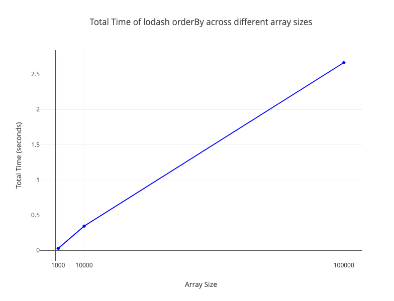

# Hello, World!

[View documentation for this example online][dox] or [View compiled example
online][compiled]

[compiled]: https://rustwasm.github.io/wasm-bindgen/exbuild/hello_world/
[dox]: https://rustwasm.github.io/docs/wasm-bindgen/examples/hello-world.html

## Prerequisites

Install Rust: [https://www.rust-lang.org/tools/install](https://www.rust-lang.org/tools/install)

## Installation

```bash
npm install
```

## How to Use

### Build

```bash
npm run serve
```

### Serve

```bash
npm run serve
# Automatically opens http://localhost:8080. You may need to reload the browser after rust finishes building
```

### Clean

```bash
npm run clean
```

### Test

```bash
npm run test
```

### Benchmark

```bash
npm run benchmark
# Automatically opens ./benchmark/output.png
```

## Benchmark Results


