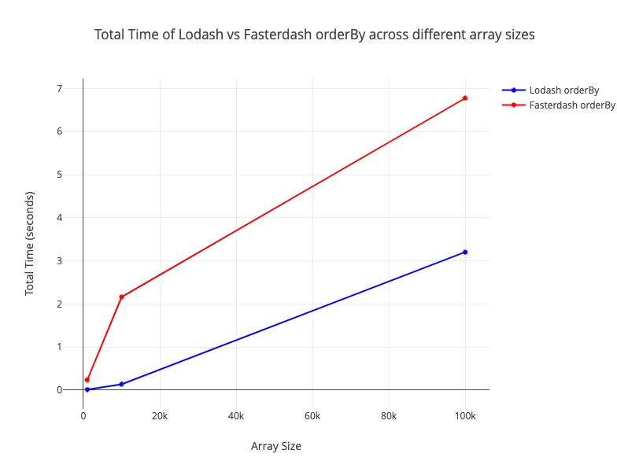

# Fasterdash

Fasterdash is a drop in replacement for Lodash using Rust and WebAssembly

## Functions Implemented and Benchmark Results

## Benchmark Results

* orderBy


## Prerequisites

Install Rust: [https://www.rust-lang.org/tools/install](https://www.rust-lang.org/tools/install)

## Installation

```bash
npm install
```

## How to Use

### Build

```bash
npm run serve
```

### Serve

```bash
npm run serve
# Automatically opens http://localhost:8080. You may need to reload the browser after rust finishes building
```

### Clean

```bash
npm run clean
```

### Test

```bash
npm run test
```

### Benchmark

```bash
npm run benchmark
# Files will be created at ./benchmark/results/*.png
```
