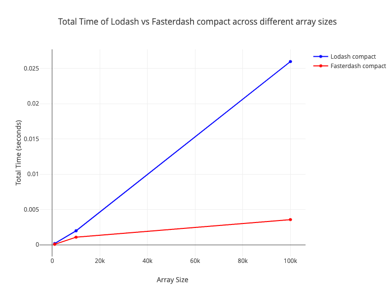

# Fasterdash

Fasterdash is a drop in replacement for Lodash using Rust and WebAssembly. Currently the only function that is supported is `compact`.

## Functions Implemented and Benchmark Results

## Benchmark Results

* compact


---

### Functions that we have decided not to include in this repo

If you look at commit `4ccfd38f5df26b0a20c03e7e40ed127c5efcbb24` you can see these additional functions implemented:

```text
chunk
cloneDeep
difference
fill
filter
flatten
flattenDeep
groupBy
merge
orderBy
range
reduce
reverse
sum
uniq
```

However they were all removed from this codebase because they were benchmarked and were slower than the pure JS implementation that lodash provides.

Future work on this repo should explore testing other lodash functions or testing these functions in unique scenarios where they might run faster and be more memory efficient that the JS implementations.
