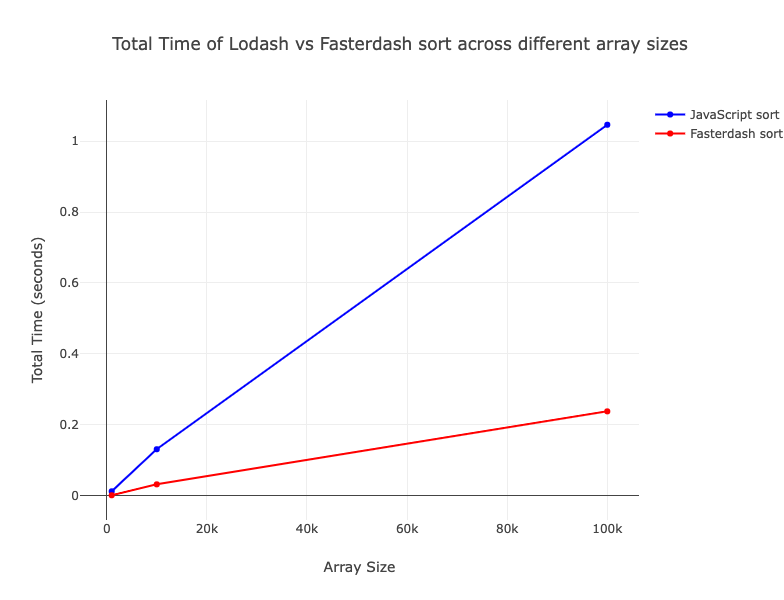

# Fasterdash

Fasterdash speeds up certain lodash functions dramatically when using integers (32 bit). The speed improvement comes from using Rust compiled into WebAssemby.

 Currently the only functions that are supported are:

* `compact`
* `sort`

## Functions Implemented and Benchmark Results

## Benchmark Results

* compact


* sort


---

### Functions that we have decided not to include in this repo

If you look at commit `4ccfd38f5df26b0a20c03e7e40ed127c5efcbb24` you can see these additional functions used to be implemented:

```text
chunk
cloneDeep
difference
fill
filter
flatten
flattenDeep
groupBy
merge
orderBy
range
reduce
reverse
sum
uniq
```

However they were all removed from this library because they were benchmarked and were slower than the pure JS implementation that lodash provides.

## Future Improvements

* Explore using generics or more permissive data types in Rust to make this package more versitile
* Test other lodash functions to optimize. There will be unique scenarios where they might run faster and be more memory efficient that the JS implementations since lodash is specifically optimized for common use cases at the expense of rare use cases. Rust especially excells at memory management compared to javascript, so functions that require a lot of new array instantiation are good targets to optimize.
* Experiment with parallelizing some operations and run them on the GPU
* Experiment with calling different functions depending on the size of the dataset. For instance for very small datasets it is likely faster to use lodash. So, for instance, this package could dynamically decide whether to use lodash or to use fasterdash implementation depending on the size of the array being passed in
* Explore if any of the functions that we decided not to include could be futher optimized in order to be faster than lodash
